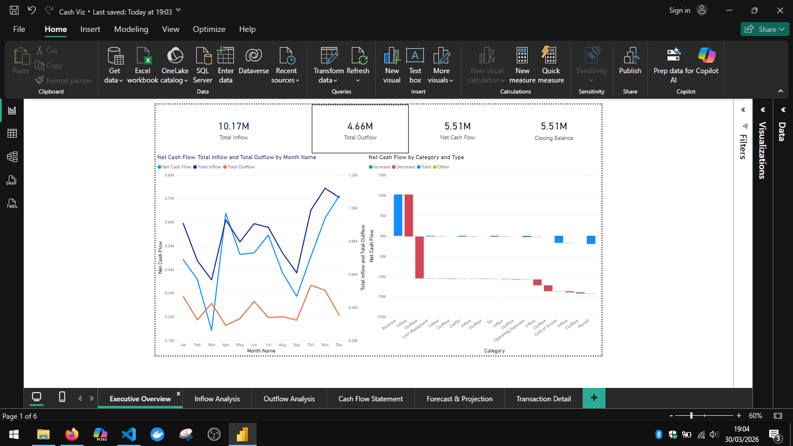
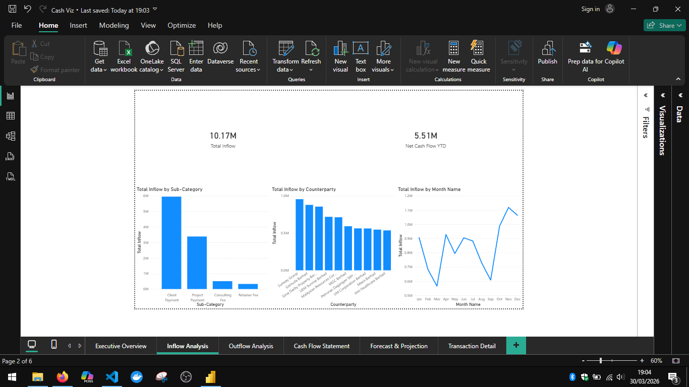
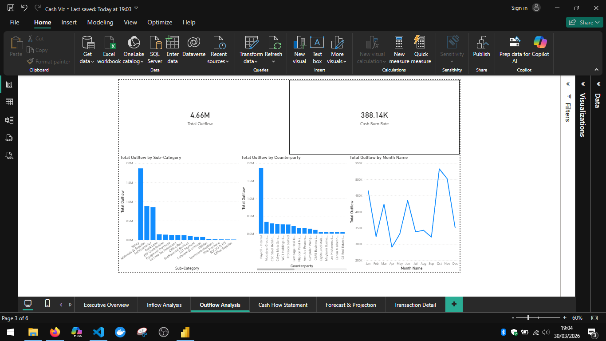
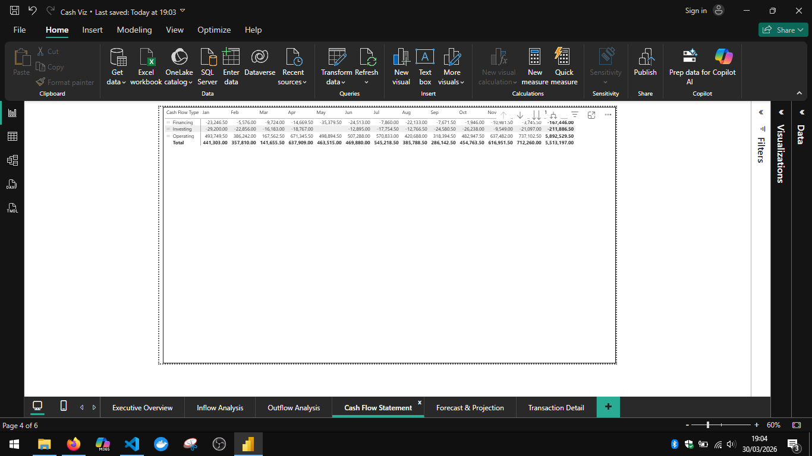
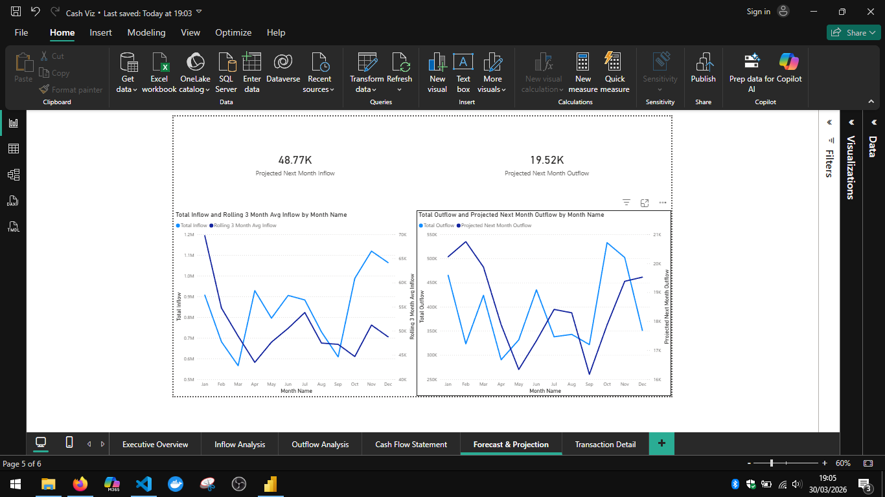
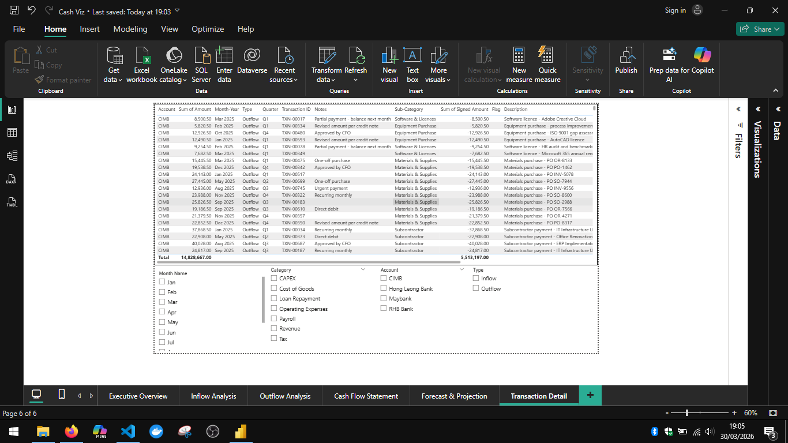

# Cash Flow Visualization — Power BI Dashboard

An interactive Power BI dashboard that visualises cash flow data from raw transaction inputs.
Built by **Zahrin Bin Jasni** as a portfolio project.

---

## Dashboard Preview

### Executive Overview


### Inflow Analysis


### Outflow Analysis


### Cash Flow Statement


### Forecast & Projection


### Transaction Detail


---

## Overview

This dashboard replaces static spreadsheet reports with a dynamic, drill-down capable BI tool.
It shows inflows, outflows, net cash position, monthly trends, category breakdowns, and short-term projections — all from a single `.pbix` file connected to a structured CSV dataset.

The dataset is Malaysian in context: MYR amounts, Malaysian banks (Maybank, CIMB, RHB, Hong Leong), Malaysian counterparties (TNB, KWSP, LHDN, PERKESO), and local business categories.

---

## Tech Stack

| Tool | Purpose |
|---|---|
| Power BI Desktop | Report authoring |
| Power Query (M) | Data ingestion, cleaning, transformation |
| DAX | KPI measures, time intelligence, forecasting |
| Python | Sample dataset generation |
| CSV | Source data format |

---

## Project Structure

```
Cash-Flow-Visualization---PowerBI/
├── data/
│   └── transactions_sample.csv    ← 750-row Malaysian transaction dataset (2025)
├── images/                        ← Dashboard screenshots
├── scripts/
│   └── generate_sample_data.py    ← Python script to regenerate sample data
├── Cash Viz.pbix                  ← Power BI report file
└── README.md
```

---

## Data Model

Star schema with one fact table and four dimension tables.

**Fact table:** `transactions_sample`
- 750 transactions across Jan–Dec 2025
- 13 columns including Date, Amount, Signed Amount, Category, Type, Account, Counterparty

**Dimension tables:**

| Table | Key Column | Purpose |
|---|---|---|
| `DimDate` | Date | Full calendar with Month, Quarter, Week, flags |
| `DimCategory` | Category | Category → Category Group → Cash Flow Type hierarchy |
| `DimAccount` | Account | Bank account list |
| `DimCounterparty` | Counterparty | Vendor and client list |
| `MeasuresTable` | — | DAX measures only, no data rows |

All dimension tables relate to `transactions_sample` via many-to-one, single cross-filter direction.

---

## DAX Measures

**Core:** Total Inflow · Total Outflow · Net Cash Flow · Closing Balance · Cash Burn Rate · Inflow vs Outflow Ratio

**Time Intelligence:** Net Cash Flow MoM % · Net Cash Flow YTD · Net Cash Flow Same Period LY · Rolling 3 Month Avg Inflow

**Forecast:** Projected Next Month Inflow · Projected Next Month Outflow · Projected Net Cash Flow

---

## Dashboard Pages

| Page | Visuals |
|---|---|
| 1 — Executive Overview | 4 KPI cards, 12-month line chart, waterfall by category |
| 2 — Inflow Analysis | Inflow cards, sub-category breakdown, top counterparties, monthly trend |
| 3 — Outflow Analysis | Outflow cards, sub-category breakdown, top vendors, monthly trend |
| 4 — Cash Flow Statement | Matrix: Operating / Investing / Financing × Month |
| 5 — Forecast & Projection | Actual vs rolling 3-month projection |
| 6 — Transaction Detail | Filterable transaction table with slicers |

---

## Sample Data

| Attribute | Detail |
|---|---|
| Rows | 750 transactions |
| Period | January 2025 – December 2025 |
| Currency | MYR (Malaysian Ringgit) |
| Inflow total | ~MYR 10.17M |
| Outflow total | ~MYR 4.66M |
| Net cash flow | ~MYR 5.51M |
| Banks | Maybank, CIMB, RHB Bank, Hong Leong Bank |

To regenerate the dataset:
```bash
python scripts/generate_sample_data.py
```

---

*Portfolio project by Zahrin Bin Jasni*
